## Sobre el proyecto
En este proyecto predigo la cancelación de clientes (**Churn**) para NexoTel, una empresa de telecomunicaciones, a partir del dataset Telco Customer Churn (`WA_Fn-UseC_-Telco-Customer-Churn.csv`, 7.043 clientes). Hice clustering de la base de clientes para entender perfiles del mercado y por qué y quienes se van. Con esto se logra elegir medidas a priorizar en las campañas de retención.

Cada decisión dentro del proyecto la respaldé por un análisis estadístico o una validación empírica.

### Puntos claves del proyecto
- **Data leakage**: separación train/test antes de ajustar escalador (`StandardScaler`), evitando data leakage
- **Feature engineering**: detección y colapso de categorías redundantes ("No internet service" duplicando `InternetService`), codificación binaria y One-Hot Encoding según cada variable.
- **EDA basado en hipótesis**: encontré patrones en los datos y los validé con gráficos y análisis estadísitcos. 
- **Selección de modelo**: comparación entre Regresión Logística y SVM (kernel RBF). Prioricé el que entregaba menos falsos negativos debido a necesidades de NexoTel.
- **Manejo del desbalance de clases**: `class_weight="balanced"` evaluado como alternativa a SMOTE/oversampling, para no sumar complejidad innecesaria al pipeline.
- **Ajuste de hiperparámetros reproducible**: búsqueda de `C` (Regresión Logística y SVM) usando Stratified 5-Fold Cross-Validation.
- **Segmentación de clientes**: K-Means (método del codo + silueta) y DBSCAN (gráfico de k-distancias + análisis de sensibilidad de `eps`) comparados entre sí para validar la robustez de los análisis previos con las lógicas de cada método (centroides vs. densidad).
- **Extra**: convergencia entre el modelo predictivo y la segmentación para identificar el perfil de mayor riesgo de churn y proponer recomendaciones de negocio
### Stack
`pandas` · `numpy` · `matplotlib` / `seaborn` · `scipy.stats` · `scikit-learn`
### Pipeline del proyecto
El siguiente diagrama resume el flujo completo, de principio a fin:

```mermaid
graph TD
    classDef titleBox fill:#ffffff,stroke:#000000,stroke-width:3px,font-size:22px,font-weight:bold;
    subgraph S1 [" "]
        style S1 fill:#d5f5e3,stroke:#2e7d32,stroke-width:2px
        T1["Carga y Preprocesamiento Inicial"]:::titleBox
        A1["Carga de datos: Telco Customer Churn<br/>(7.043 filas, 21 columnas)"]
        A2["Revisión de duplicados<br/>(fila completa y por customerID)"]
        A3["Corrección de TotalCharges<br/>(strings vacíos → 0, ligado a tenure = 0)"]
        A4["Conversión de tipos en variables<br/>(TotalCharges a float, SeniorCitizen a booleano)"]
        A1 --> A2 --> A3 --> A4
        T1 ~~~ A1
    end
    subgraph S2 [" "]
        style S2 fill:#d6eaf8,stroke:#1565c0,stroke-width:2px
        T2["Feature Engineering y Preparación"]:::titleBox
        B1["Detección de redundancia categórica<br/>('No internet/phone service' duplica InternetService/PhoneService)"]
        B2["Colapso de categorías redundantes<br/>(simplifica el One-Hot Encoding posterior)"]
        B3["Codificación binaria → booleano<br/>(evita columnas redundantes de OHE)"]
        B4["One-Hot Encoding<br/>(solo nominales: Contract, InternetService, PaymentMethod)"]
        B5["Train/Test Split 80/20<br/>stratify=y, antes de escalar (evita data leakage)"]
        B6["StandardScaler ajustado solo con train<br/>(tenure, MonthlyCharges, TotalCharges)"]
        B1 --> B2 --> B3 --> B4 --> B5 --> B6
        T2 ~~~ B1
    end
    subgraph S3 [" "]
        style S3 fill:#fcf3cf,stroke:#f5b041,stroke-width:2px
        T3["EDA y Visualización"]:::titleBox
        C1["Distribución de Churn<br/>(countplot) → clases desbalanceadas → decisión de estratificar"]
        C2["Countplots univariados<br/>de variables categóricas"]
        C3["Tasa de churn por categoría<br/>(gráficos de barra: Contract, InternetService, PaymentMethod)"]
        C4["Boxplots tenure / MonthlyCharges vs Churn"]
        C5["Validación de hipótesis de negocio<br/>(ej. tenure en contratos mensuales, MonthlyCharges por tipo de internet)"]
        C6["Detección de outliers en tenure (IQR)<br/>por grupo de Churn"]
        C1 --> C2 --> C3 --> C4 --> C5 --> C6
        T3 ~~~ C1
    end
    subgraph S4 [" "]
        style S4 fill:#e8daef,stroke:#7d3c98,stroke-width:2px
        T4["Modelado — Selección y Ajuste de Hiperparámetros"]:::titleBox
        D1["Regresión Logística<br/>(rápida, interpretable, entrega probabilidades calibradas)"]
        D2["SVM — kernel RBF<br/>(captura relaciones no lineales, robusto a outliers)"]
        D3["Manejo del desbalance: class_weight='balanced'<br/>(SMOTE/oversampling evaluado y descartado)"]
        D4["Ajuste de C vía Stratified 5-Fold CV<br/>optimizando ROC-AUC (umbral aún no definido)"]
        D1 --> D3
        D2 --> D3
        D3 --> D4
        T4 ~~~ D1
    end
    subgraph S5 [" "]
        style S5 fill:#fadbd8,stroke:#c0392b,stroke-width:2px
        T5["Evaluación y Decisión de Negocio (Modelo)"]:::titleBox
        E1["Métricas a umbral 0.5<br/>(Accuracy, Precision, Recall, F1) + matrices de confusión"]
        E2["Curvas ROC<br/>(LR y SVM casi empatados: AUC 84% vs 83.6%)"]
        E3["Falso negativo priorizado<br/>(negocio: no detectar a un churner cuesta más que una falsa alarma)"]
        E4["Regresión Logística seleccionada<br/>(menos falsos negativos: 82 vs 145; más interpretable)"]
        E1 --> E2 --> E3 --> E4
        T5 ~~~ E1
    end
    subgraph S6 [" "]
        style S6 fill:#d1f2eb,stroke:#0e6655,stroke-width:2px
        T6["Segmentación — K-Means"]:::titleBox
        F1["Selección de variables<br/>(heatmap descarta TotalCharges; Cramér's V confirma independencia Contract–InternetService)"]
        F2["Elección de k<br/>(método del codo + coeficiente de silueta) → k = 6"]
        F3["Validación interna<br/>(silueta 0.4477, Davies-Bouldin 0.9326)"]
        F4["Caracterización de clústeres<br/>(crosstabs + scatterplots) → 6 perfiles de negocio nombrados"]
        F1 --> F2 --> F3 --> F4
        T6 ~~~ F1
    end
    subgraph S7 [" "]
        style S7 fill:#fdebd0,stroke:#ca6f1e,stroke-width:2px
        T7["Segmentación — DBSCAN"]:::titleBox
        G1["Elección de min_samples y eps<br/>(regla 2×dimensiones; gráfico de k-distancias)"]
        G2["Análisis de sensibilidad de eps<br/>(9 clústeres estables en el rango probado)"]
        G3["Comparación K-Means vs DBSCAN<br/>(crosstab cruzado — mismo hallazgo principal por dos métodos distintos)"]
        G4["K-Means elegido para negocio<br/>(cubre a todos los clientes; más simple de operar en campañas)"]
        G1 --> G2 --> G3 --> G4
        T7 ~~~ G1
    end
    subgraph S8 [" "]
        style S8 fill:#fce4ec,stroke:#ad1457,stroke-width:2px
        T8["Síntesis e Interpretación de Negocio"]:::titleBox
        H1["Coeficientes de la Regresión Logística<br/>(interpretabilidad: qué variables empujan el churn)"]
        H2["Cruce modelo × segmentos<br/>(el ranking de riesgo del modelo coincide con el churn real por clúster)"]
        H3["Perfil de mayor riesgo<br/>('Fibra de alto riesgo': cliente nuevo, fibra óptica, contrato mensual)"]
        H4["Recomendaciones accionables<br/>(migración a contrato anual + acompañamiento en los primeros 3 meses)"]
        H1 --> H2 --> H3 --> H4
        T8 ~~~ H1
    end
    %% Conexiones entre secciones para forzar el apilamiento vertical
    A4 --> S2
    B6 --> S3
    C6 --> S4
    D4 --> S5
    E4 --> S6
    F4 --> S7
    G4 --> S8
```

## Aquí algunos gráficos dentro del notebook.

